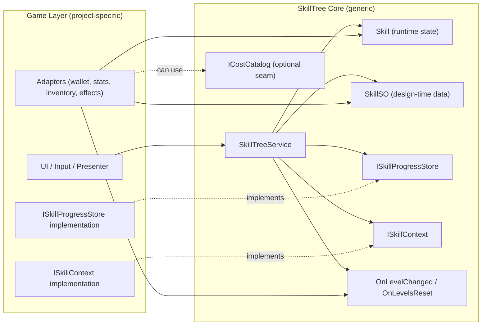

# Unity Skill Tree

A generic, data-driven, reusable Skill Tree module for Unity.

## Architecture Snapshot



## Responsibility Boundary

- `SkillTree core` is responsible for progression only.
- Skill validation (ids, max level, prerequisite references, cycle detection)
- Upgrade flow (prerequisite check, affordability check, payment attempt, level increase)
- Persistence orchestration through `ISkillProgressStore`
- Event emission (`OnLevelChanged`, `OnLevelsReset`)

- `Game layer` is responsible for gameplay meaning.
- How costs are paid (gold/items/energy source)
- How effects are interpreted and applied to actual systems
- UI and scene-level composition

## File Mapping (Current Code)

- Core API and orchestration: `Assets/SkillTree/Scripts/Core/SkillTreeService.cs`
- Design-time skill data + generic effect/cost descriptors: `Assets/SkillTree/Scripts/Core/SkillSO.cs`
- Runtime skill state snapshot: `Assets/SkillTree/Scripts/Core/Skill.cs`
- Persistence contract: `Assets/SkillTree/Scripts/Core/ISkillProgressStore.cs`
- Payment contract for upgrade transaction: `Assets/SkillTree/Scripts/Core/ISkillContext.cs`
- Cost support seam (currently not wired in `SkillTreeService`): `Assets/SkillTree/Scripts/Core/ICostCatalog.cs`

- Demo composition root: `Assets/SkillTree/Scripts/Demo/SkillTreeBehaviour.cs`
- Demo persistence implementation: `Assets/SkillTree/Scripts/Demo/SkillPersistenceService.cs`
- Demo payment context placeholder (not implemented yet): `Assets/SkillTree/Scripts/Demo/WalletContext.cs`

## Upgrade Flow (Current)

```text
TryUpgrade(skillId, context)
-> Validate skill exists
-> Check prerequisites met
-> Check max level
-> context.CanPay(skill.UpgradeCosts)
-> context.TryPay(skill.UpgradeCosts)
-> IncreaseLevel
-> SaveProgression
-> Raise OnLevelChanged
```

## Important Notes

- `EffectDefinition` is intentionally descriptive data, not direct gameplay logic.
- `SkillTreeService` does not apply effects to stats/combat systems.
- To plug into another game, keep core unchanged and replace only adapter implementations.
- `ISkillContext`
- `ISkillProgressStore`
- Effect listener(s) subscribed to SkillTree events
