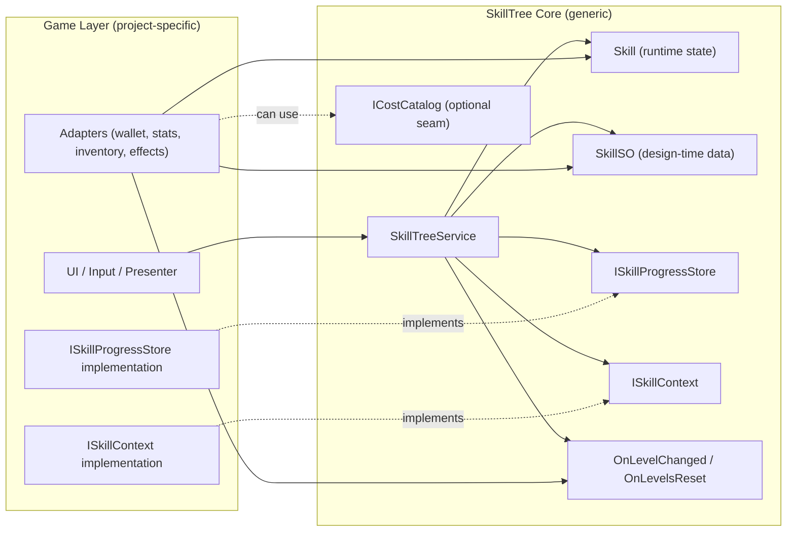

# Unity Skill Tree System

> A generic, data-driven, reusable Skill Tree module for Unity.

## Features

- Fully decoupled from game logic
- Data-driven (ScriptableObject based)
- Supports unlock + upgrade progression
- Multiple cost types
- Event-driven effect emission
- Pluggable persistence layer
- Designed for reuse across projects

## Architecture

The system is split into two layers:

- SkillTree Core (generic, reusable)
- Game Layer (project-specific implementation)

Dependency direction:

Game → SkillTree  
SkillTree never depends on Game.

## Upgrade Flow

Upgrade Flow:

1. Validate skill existence
2. Check prerequisites
3. Check max level
4. Validate cost via ISkillContext
5. Commit payment
6. Increase level
7. Save progression
8. Emit OnLevelChanged event

## Integration

To integrate into your game:

1. Implement ISkillContext
2. Implement ISkillProgressStore
3. Subscribe to OnLevelChanged event
4. Convert EffectDefinition to your game-specific modifiers